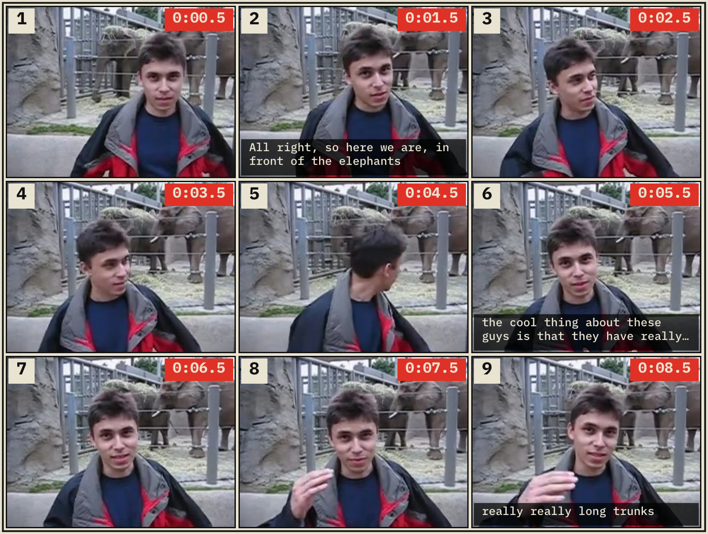

# vidgrid

[](https://pypi.org/project/vidgrid/)
[](https://pypi.org/project/vidgrid/)
[](LICENSE)
[](https://pypi.org/project/vidgrid/)
[](https://vidgrid.site)

> Convert video clips into annotated image grids for vision LLM analysis.
> **One cell = one second, by default.**



LLMs can't watch video, but they can analyze a single image. `vidgrid` samples
one frame per second from a video, tiles them into a numbered storyboard with
timestamps, and optionally sends the result to Claude, GPT, or Gemini with a
prompt. The result is something close to "my LLM just watched a video" for
the cost of a handful of image uploads.

**Don't want to install?** Use the hosted version at
[vidgrid.site](https://vidgrid.site) — drop a file, get the grid in the
browser. 3 free renders, $5 lifetime after that. Free for ever on the CLI.

## The model

**One cell = one second, by default.** The auto-picker chooses the smallest
grid (biggest, most-legible cells) whose board count stays under
`--max-boards` (default 10). When that's not enough for a long clip, it
bumps the grid up; as a last resort, it reduces the sampling rate. Override
with `--fps` and `--max-boards` for full control.

- Grid size determines how many seconds fit in one photo
- Default sampling is 1fps; drops below 1fps only when needed to stay under the max-boards cap
- Videos over 5 minutes are rejected (chop them up first)

| Grid | Cells | Seconds per photo | Best for |
|---|---|---|---|
| `2x2` | 4 | 4 | Very short clips (2–4s) |
| `3x3` | **9** | **9** | **Default — best overall readability** |
| `4x4` | 16 | 16 | More compact, cells get smaller |
| `5x5` | 25 | 25 | Experimental — cells small, LLM accuracy drops |

**Quality degrades with bigger grids.** Cells shrink, detail is lost, and the
LLM has a harder time reading fine content like text or UI elements. Stick
with 3×3 unless you specifically need to pack more seconds into one photo.
5×5 exists mostly as a "let me see what happens" option.

## How many photos a video produces

At 1fps sampling, the board count at each grid size:

| Video length | 2×2 | 3×3 | 4×4 | 5×5 |
|---|---|---|---|---|
| 3s    | **1** (partial) | 1 (partial) | 1 (partial) | 1 (partial) |
| 9s    | **3** | 1 | 1 (partial) | 1 (partial) |
| 25s   | **7** | 3 | 2 | 1 |
| 60s   | 15 | **7** | 4 | 3 |
| 186s (3 min) | 47 | 21 | **12** | 8 |
| 300s (5 min, cap) | 75 | 34 | **19**¹ | 12 |

**Bold** = what `auto` picks — the smallest grid (biggest cells) that
keeps the board count under `--max-boards` (default 10).

¹ At the 5-min cap, even 4×4 exceeds 10 boards at 1fps, so auto drops
the sampling rate (≈1 cell per 1.9s) to land at the 10-board limit. Use
`--fps 1.0 --max-boards 20` to preserve 1fps and accept more boards.

Most vision LLMs accept ~10–20 images per request, so auto's default
ceiling of 10 keeps a full video inside a single model call.

## Install

```bash
pip install vidgrid                         # core renderer only
pip install vidgrid[transcribe]             # + faster-whisper for --transcribe
pip install vidgrid[anthropic]              # + Claude support via --ask
pip install vidgrid[llm]                    # + Claude + GPT + Gemini
pip install vidgrid[all]                    # everything
```

Requires Python 3.9+ and `ffmpeg` on your `PATH`.

## Quick start

```bash
# 1. Auto-pick grid and sampling rate — smallest grid that fits in 10 boards
vidgrid clip.mp4 -o grid.png

# 2. Force a specific grid
vidgrid clip.mp4 -o grid.png --grid 4x4

# 3. Force a sampling rate — 0.5fps = 1 cell every 2 seconds
vidgrid long-clip.mp4 -o grid.png --fps 0.5

# 4. Raise the max-boards ceiling (default 10) if you want more boards
vidgrid lecture.mp4 -o grid.png --max-boards 20

# 5. Render + auto-transcribe + send to Claude in one call
vidgrid lecture.mp4 --transcribe --ask "bullet-point summary"

# 6. Use existing Whisper captions, burn them onto the grid
vidgrid interview.mp4 -o grid.png --captions whisper.json --burn-captions

# 7. Let the CLI fall back to python -m if the console script isn't on PATH
python3 -m vidgrid clip.mp4 -o grid.png
```

## Three things you can do with it

### 1. Summarize a talk without watching it

```bash
vidgrid "team-meeting.mp4" \
  --transcribe \
  --ask "list the decisions made and who owns each" \
  --model claude-opus-4-7
```

vidgrid samples one frame per second, runs Whisper on the audio, sends the
grid + transcript to Claude, and prints the answer. The model correlates
frames and words via the burned-in timestamps.

### 2. Find a specific moment in a screen recording

```bash
vidgrid bug-repro.mp4 --grid 3x3 \
  --ask "at which numbered frame does the error dialog appear?" \
  --model gpt-5
```

Because cells are globally numbered (1, 2, 3...) and tagged with timestamps,
the model can point you at the exact moment. No scrubbing.

### 3. Rank a pile of stock footage

```bash
for clip in broll/*.mp4; do
  vidgrid "$clip" -o "grids/$(basename $clip .mp4).png"
done
```

Send the PNGs to Claude in a single request and ask it to rank or reject
clips against your shot list. This is the workflow vidgrid was built for.

## Portrait vs landscape

vidgrid keeps the grid shape square (N×N) regardless of source orientation
and preserves the source aspect inside each cell. Landscape sources produce
wide boards; portrait sources produce tall boards. Cells are never cropped.

## Two-layer captions (default)

The default mode gives the LLM **two correlated inputs**: the rendered grid
image AND the Whisper transcript as separate text. The model correlates them
via the timestamps printed on each cell.

This beats burning captions into the image because:

1. Frames keep their pixels for actual content
2. Text is higher fidelity as tokens than as baked-in pixels
3. The grid stays clean and shareable

Add `--burn-captions` if you want a self-contained image (useful for sharing
or offline analysis).

## Caption file formats

vidgrid reads and writes three caption formats. The `--captions` flag
auto-detects from the file extension. The `--transcript-format` flag
controls what `--transcribe` writes.

| Format | Extension | Size (36 words) | When to use |
|---|---|---|---|
| `json` | `.json` | ~4.8 KB | Remotion pipelines, tools that need word confidence |
| `srt` | `.srt` | ~1.4 KB | Video editors, universal subtitle format |
| `txt` | `.txt` | ~0.4 KB | Smallest, grep-friendly, trivial to parse |

**JSON** (default, Remotion-compatible):
```json
[
  {"text": "hello", "startMs": 0, "endMs": 500, "timestampMs": 0, "confidence": 0.98},
  ...
]
```

**SRT** (SubRip subtitles):
```
1
00:00:00,000 --> 00:00:00,500
hello

2
00:00:00,500 --> 00:00:01,000
world
```

**TXT** (plain timestamped text, one word per line):
```
0.00 hello
0.50 world
```

Use any format as input, output, or both. You can mix — read an `.srt` and
write a `.txt` with `--captions foo.srt --transcript-format txt`.

## Python API

```python
from vidgrid import render

storyboard = render(
    input_path="interview.mp4",
    output_path="grid.png",
    grid="3x3",  # or "2x2", "4x4", "5x5", or None for auto
    transcribe=True,
)

print(storyboard.board_paths)        # ['grid-1.png', 'grid-2.png', ...]
print(storyboard.transcript_path)    # 'grid-transcript.json'
print(storyboard.all_samples)        # list[Sample] with timestamps
```

Modules: `vidgrid.probe`, `vidgrid.sample`, `vidgrid.compose`,
`vidgrid.captions`, `vidgrid.llm`, `vidgrid.presets`.

## Output structure

**Single-board run:**
```
grid.png                 # the storyboard
grid.json                # sidecar: timestamps, layout, source info
grid-transcript.json     # only if --transcribe or --captions was used
```

**Multi-board run:**
```
grid-1.png, grid-2.png, grid-3.png, ...
grid.json                # index covering all boards + global cell numbering
grid-transcript.json
```

Cells are numbered **globally** across boards. A 3-board run has cells 1–27
so the LLM can reference any frame without ambiguity.

## Limits and caveats

- **5-minute hard cap on video length.** Longer videos are rejected. Chop
  them up with `ffmpeg -ss START -t 300 input.mp4 chunk.mp4`.
- **No scene detection.** v1 samples strictly 1 frame per second, uniform.
  No dedupe, no shifting — the spacing is always exactly 1 second.
- **Variable-framerate videos** may have sub-frame seek drift (≤1 frame),
  which is acceptable at 1fps sampling.
- **Bigger grids hurt legibility.** A 5×5 grid has cells ~300px wide; fine
  for people and objects, marginal for dense text or code. Stick with 3×3.
- **LLM integration** uses the official SDKs (anthropic, openai, google-genai)
  and won't be installed unless you request them as extras.

## Prior art

- [IG-VLM](https://arxiv.org/abs/2403.18406) — research paper proving the grid trick works
- [llm-video-frames](https://github.com/simonw/llm-video-frames) — Simon Willison's per-frame approach
- [vcsi](https://github.com/amietn/vcsi) — contact sheets without LLMs
- [byjlw/video-analyzer](https://github.com/byjlw/video-analyzer) — whisper + sequential frames

vidgrid's differentiator: **1 cell = 1 second, numbered cells, simple CLI,
multi-provider LLM integration in one package**.

## License

MIT. The bundled Source Sans 3 font is licensed under [SIL OFL 1.1](vidgrid/assets/fonts/LICENSE-SourceSans3.md).
